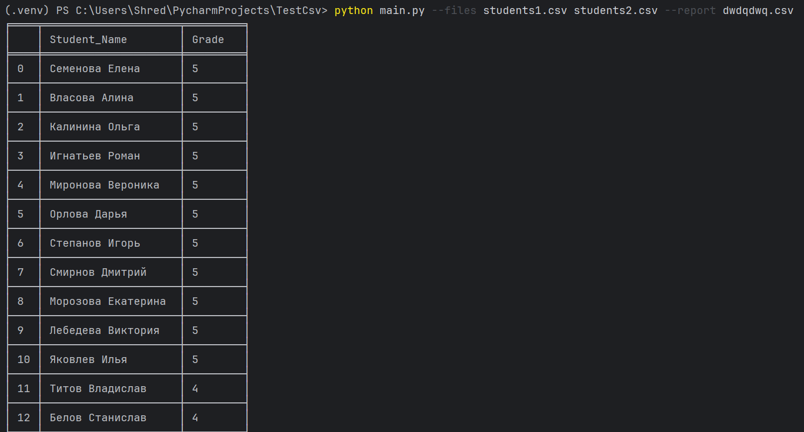
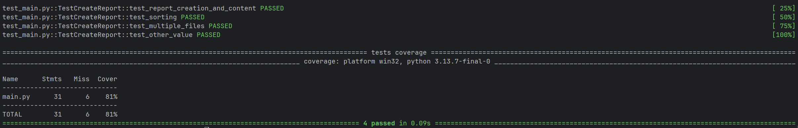

# Student Performance Report

Скрипт для анализа успеваемости студентов на основе CSV-файлов.

## Функциональность

- Чтение одного или нескольких CSV-файлов с данными об успеваемости
- Расчет средней оценки для каждого студента по всем предметам
- Сортировка студентов по убыванию успеваемости
- Генерация отчета в формате CSV
- Вывод красивой таблицы в консоль

### Требуемый формат входных данных
Файлы csv
```csv
student_name,subject,teacher_name,date,grade
Иванов Иван,Математика,Петрова А.А.,2023-10-10,5
Петров Петр,Физика,Сидоров Б.Б.,2023-10-12,4
```
# Запуск проекта
### Клонирование репозитория
```
git clone <repository-url>
cd student-performance
```
### Установка зависимостей
```
pip install -r requirements.txt
```

### Запуск скрипта
```
python main.py --files data1.csv data2.csv --report performance.csv
```
# Конфигурация
### Параметры командной строки
```
--files, -f: Пути к CSV-файлам (один или несколько) - обязательный параметр
--report, -r: Название файла для отчета (по умолчанию: report.csv)
--value, -v:  Название объекта по которому будет отчет (необязательный параметр, по умолчанию: student)
```

# Тестирование
Тестирование затрагивает основную чать проекта тестируя все необходимые модули
Покрытие проекта составляет 81%+ с использование pytest 


# Технологии 
- Python 3.8+
- Standard Library: argparse, csv, statistics, collections
- Для тестирования: pytest, pytest-cov
- Для вывода в консоль: tabulate